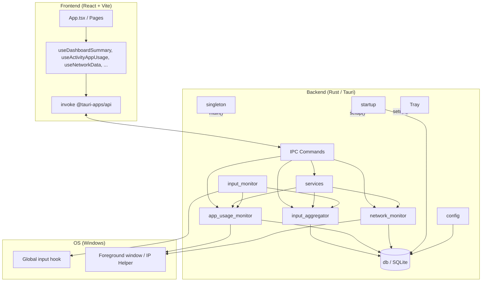
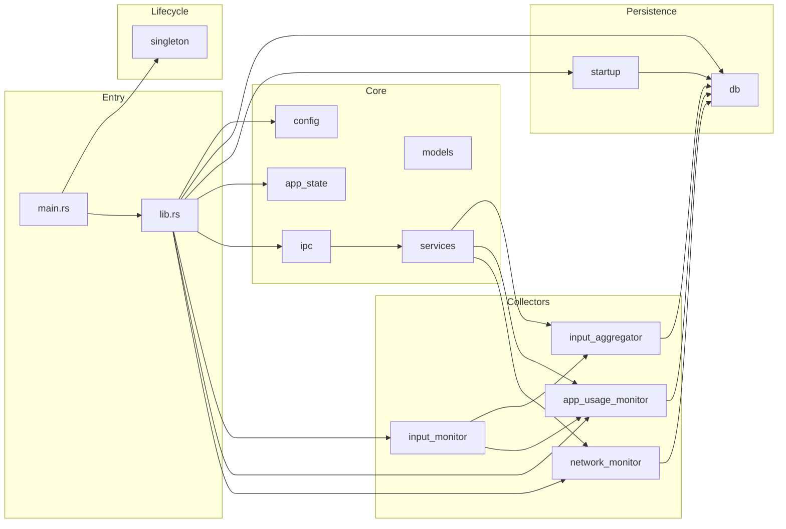
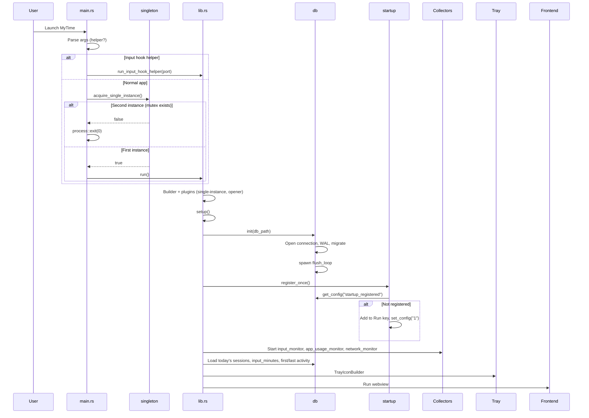
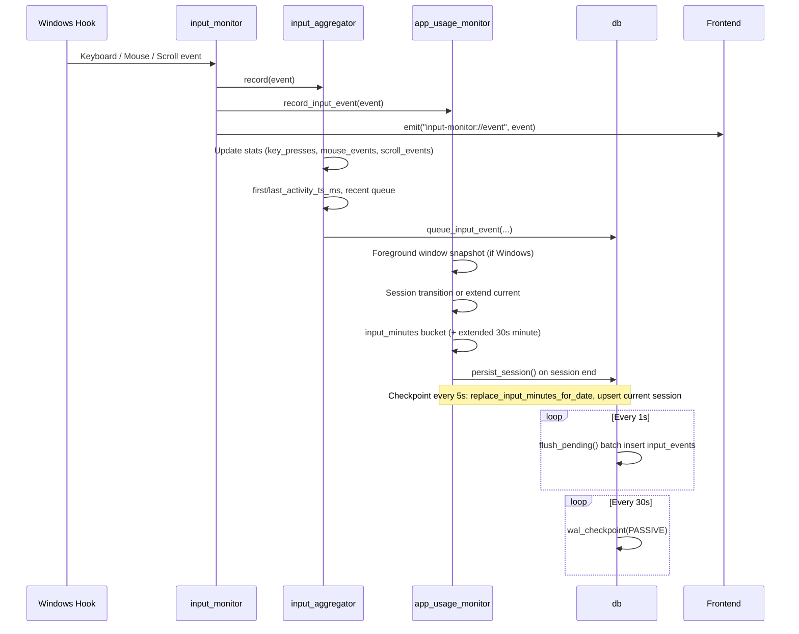
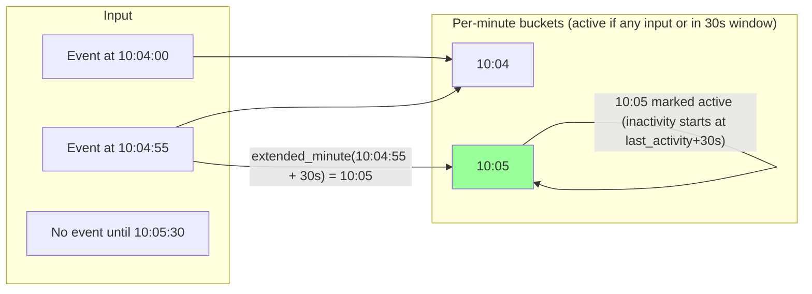
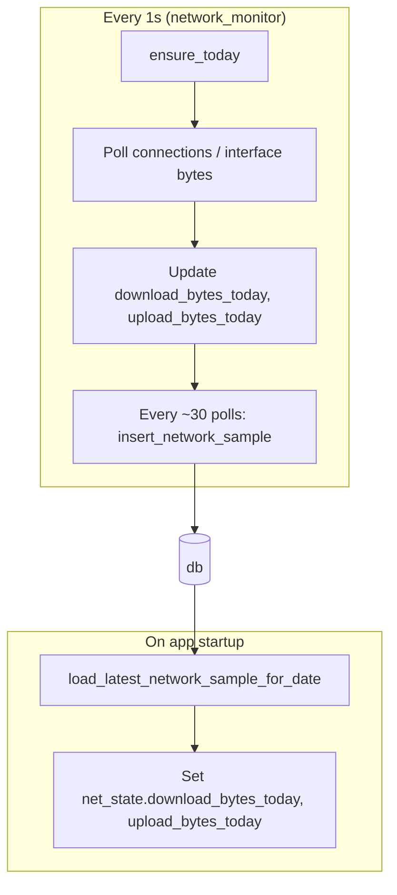

# MyTime

**MyTime** is a local-first desktop application for **activity tracking**, **application usage analytics**, and **network monitoring**. It runs as a Tauri app (Rust backend + React frontend), primarily targeting Windows, and keeps all data on your machine in a single SQLite database.

---

## Table of Contents

- [Features & Functionality](#features--functionality)
- [Principles](#principles)
- [Tech Stack](#tech-stack)
- [Architecture](#architecture)
- [Workflows](#workflows)
- [Data Storage](#data-storage)
- [Project Structure](#project-structure)
- [Development & Build](#development--build)

---

## Features & Functionality

### Activity & Input Monitoring

- **Global input capture** (keyboard, mouse, scroll) via a low-level Windows hook (in-process or optional helper process).
- **Live activity feed**: recent events with type, description, and timestamp.
- **Dashboard metrics**: active time today, keystrokes, mouse events (clicks & movements), with first/last activity timestamps.
- **30-second inactivity rule**: activity is considered to extend **30 seconds** after the last input; inactivity starts at `last_activity + 30s` (not at “now”). This is applied when bucketing per-minute activity for timelines and heatmaps.
- **Application usage**: foreground window tracking (process name, window title, PID), session duration, and per-session/per-app input counts (keystrokes, clicks, scrolls).
- **Activity timeline & heatmap**: daily/hourly active vs inactive time, and a 7×24 heatmap (weekday × hour) with intensity 0–100.
- **Timeline editor**: multi-track view (activity status + app usage) with zoom and minimap (ManicTime-style).

### Network Monitoring

- **Real-time traffic**: interface-level and, when available, per-TCP-connection byte counters (Windows IP Helper APIs).
- **Per-process bandwidth**: download/upload by process, connection count, peak bps.
- **Active connections**: TCP/UDP with local/remote address, port, state, and process.
- **Speed & latency**: current download/upload bps, latency probe (e.g. 8.8.8.8:53), optional speed test.
- **Daily totals**: download/upload bytes today, persisted and restored across restarts.

### Persistence & Lifecycle

- **SQLite database**: single file (`mytime.sqlite3`) in the app data directory; one long-lived connection, WAL mode, atomic writes, and a passive WAL checkpoint every 30 seconds.
- **Persistence across restarts**: activity sessions, input-minute buckets, input-event log, and network daily totals are loaded from SQLite on startup so recording continues from the last state.
- **Single instance**: only one app process (Windows named mutex `Local\MyTimeSingleInstance`); a second launch exits immediately.
- **System tray**: closing the main window hides it to the tray; the app keeps running and recording. Clicking the tray icon shows and focuses the main window.
- **Start at login**: optional one-time registration in `HKCU\...\Run` so the app starts with Windows; “already registered” is stored in the DB so it is not re-registered on every launch.

---

## Principles

- **Local-first**: All telemetry stays on the machine. No mandatory cloud or external servers.
- **Privacy**: No keylogging of content; only key *press* events and high-level labels (e.g. “Press A”). No screenshots or document content.
- **Crash-safe writes**: SQLite with `synchronous=FULL`, `BEGIN IMMEDIATE` transactions, and WAL checkpoints to limit WAL growth and reduce risk of corruption on unexpected shutdown.
- **Single connection**: The database is opened once at startup and reused for the app lifetime (no open/close per operation) to avoid repeated I/O and connection churn.
- **One process**: Singleton enforcement so only one instance runs; second launch exits without starting the UI.
- **Minimal UI when “closed”**: Window close hides to tray; collectors keep running so activity and network data are continuous.

---

## Tech Stack

| Layer        | Technology |
|-------------|------------|
| Desktop shell | [Tauri 2](https://v2.tauri.app/) |
| Backend     | Rust (std, `chrono`, `rusqlite`, `tracing`, `windows` / `windows-registry`) |
| Frontend    | React 19, TypeScript, Vite 7 |
| UI          | Tailwind CSS 4, Radix UI, Recharts, Lucide icons, Motion |
| Database    | SQLite 3 (WAL mode, single connection) |
| Plugins     | `tauri-plugin-opener`, `tauri-plugin-single-instance` |

---

## Architecture

### High-level component diagram



### Backend module layout



---

## Workflows

### 1. Application startup and single instance



### 2. Input event to storage and UI



### 3. Activity session and 30s inactivity rule



- **Rule**: Inactivity starts at **last_activity + 30s**, not at the current time.
- **Implementation**: For each event at time `T`, we update the minute containing `T` and the minute containing `T + 30s` (if different and same day), so the 30s grace period is reflected in per-minute activity.

### 4. Network monitoring and persistence



### 5. Window close and tray

```mermaid
stateDiagram-v2
    [*] --> WindowVisible: App started
    WindowVisible --> TrayHidden: User clicks Close (X)
    note right of TrayHidden: on_window_event: hide(), prevent_close()
    TrayHidden --> WindowVisible: User clicks tray icon
    TrayHidden --> TrayHidden: Collectors keep running
```

- **Close button**: `CloseRequested` is handled by hiding the window and calling `api.prevent_close()` so the process and collectors keep running.
- **Tray**: One tray icon; click shows and focuses the main window.

---

## Data Storage

### Location

- **Database file**: `mytime.sqlite3` in the Tauri app data directory.
- **Typical path (Windows)**:  
  `%APPDATA%\com.administrator.mytime\mytime.sqlite3`  
  (e.g. `C:\Users\<You>\AppData\Roaming\com.administrator.mytime\mytime.sqlite3`).
- **Logs**: `logs/` under the same app data directory (e.g. daily `mytime.log`).

Paths are resolved in `config.rs` via `app.path().app_data_dir()`.

### Connection strategy

- **One connection** is opened in `db::init()` and held in `OnceLock<Mutex<Connection>>` for the app lifetime.
- No per-request open/close; all reads and writes use this connection (and its transactions), which avoids repeated connect/disconnect I/O.

### Tables (conceptual)

| Table              | Purpose |
|--------------------|--------|
| `schema_version`   | DB migration version. |
| `config`           | Key-value (e.g. `startup_registered`). |
| `input_events`     | Log of input events (ts_ms, kind, action, label, …). |
| `activity_sessions`| App usage sessions (id, date, app_id, app_name, title, pid, started_at_ms, ended_at_ms, key_presses, mouse_clicks, scroll_events, icon_data_url). |
| `input_minutes`    | Per-date, per-minute aggregates (minute_of_day, key_presses, mouse_clicks, mouse_moves, scroll_events). |
| `network_samples`  | Periodic snapshots (date, ts_ms, download_bytes_today, upload_bytes_today, active_connections, download_bps, upload_bps, latency_ms, is_online). |

### Writes and durability

- **WAL mode**: Changes go to the write-ahead log; the main DB file is updated on checkpoint.
- **synchronous=FULL**: Commits are flushed to disk for crash safety.
- **busy_timeout**: 5 s to avoid immediate failure under contention.
- **Transactions**: Multi-statement writes use `BEGIN IMMEDIATE` and a single commit.
- **Periodic checkpoint**: Every 30 s a passive `PRAGMA wal_checkpoint(PASSIVE)` runs to keep WAL size bounded.

---

## Project Structure

```
mytime/
├── src/                          # Frontend (React + Vite)
│   ├── main.tsx
│   ├── app/
│   │   ├── App.tsx               # Root layout, tabs, theme
│   │   ├── api/                  # Tauri invoke wrappers (tauri.ts, etc.)
│   │   ├── hooks/                # useDashboardSummary, useActivityAppUsage, useNetworkData, ...
│   │   ├── components/           # UI (Sidebar, StatCard, ActivityTimeline, Network*, Timeline, Help)
│   │   ├── activityAppUsage.ts   # Map backend DTOs → timeline/heatmap/status
│   │   └── types/backend.ts      # TypeScript types for IPC DTOs
│   └── styles/
├── src-tauri/                    # Backend (Rust)
│   ├── Cargo.toml
│   ├── tauri.conf.json
│   ├── src/
│   │   ├── main.rs               # Entry, helper process, singleton check
│   │   ├── lib.rs                # Tauri builder, setup, tray, window close handler
│   │   ├── config.rs             # App paths (data_dir, log_dir, db_path)
│   │   ├── app_state.rs          # AppState (paths, started_at, backend_mode)
│   │   ├── singleton.rs          # Windows named mutex for single instance
│   │   ├── startup.rs            # One-time Run key registration (Windows)
│   │   ├── db.rs                 # SQLite init, WAL checkpoint, queues, CRUD
│   │   ├── ipc.rs                # Tauri commands (get_app_status, get_dashboard_summary, ...)
│   │   ├── services.rs           # build_app_status, build_dashboard_summary, build_activity_timeline, ...
│   │   ├── models.rs             # DTOs (AppStatusDto, DashboardSummaryDto, ...)
│   │   ├── input_monitor.rs      # Global hook, helper process, event emission
│   │   ├── input_aggregator.rs   # Stats + recent events, hydrate from DB on init
│   │   ├── app_usage_monitor.rs   # Foreground window, sessions, input_minutes, 30s inactivity
│   │   └── network_monitor.rs    # IP Helper, connections, bandwidth, latency, DB samples
│   └── capabilities/
├── package.json
├── vite.config.ts
└── README.md                     # This file
```

---

## Development & Build

### Prerequisites

- Node.js and npm (or equivalent) for the frontend.
- Rust toolchain and Tauri CLI for the backend.
- Windows SDK / build tools for the Windows target.

### Commands

```bash
# Install frontend dependencies
npm install

# Development (Vite dev server + Tauri window)
npm run tauri dev

# Build for production
npm run tauri build
```

### Configuration

- **App identity**: `tauri.conf.json` — `identifier`: `com.administrator.mytime`, `productName`: `mytime`.
- **Backend**: Paths and DB location come from Tauri’s `app_data_dir()`; no separate config file is required for basic use.
- **Logging**: Backend uses `tracing` with a daily rolling file in `logs/`; level can be influenced by the `RUST_LOG` environment variable.

---

## License and attribution

See the repository for license and attribution details. MyTime is a local-first activity and network tracker built with Tauri 2 and React.
